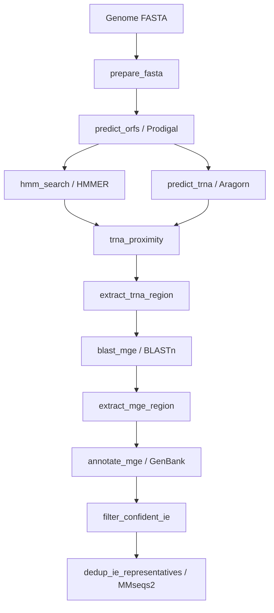

# finder_pipeline

Snakemake workflow for discovering **integrative elements (IEs)** in prokaryotic genome assemblies. The pipeline identifies tyrosine recombinase (integrase) genes, links each hit to a nearby tRNA on the opposite strand, extracts the candidate insertion region by BLAST, annotates attachment sites (attL/attR), applies strict quality filters, and produces a deduplicated set of representative sequences across the cohort.

**Primary deliverable:** `results/dedup/ie_representatives.fa` and `results/dedup/rep_index.tsv`.

---

## Table of contents

- [What the pipeline does](#what-the-pipeline-does)
- [Requirements](#requirements)
- [Installation](#installation)
- [Quick start](#quick-start)
- [Input data](#input-data)
- [Configuration](#configuration)
- [Pipeline stages](#pipeline-stages)
- [Output files](#output-files)
- [Confident IE filters](#confident-ie-filters)
- [Cohort deduplication](#cohort-deduplication)
- [Large-scale batch runs](#large-scale-batch-runs)
- [Post-run statistics](#post-run-statistics)
- [Testing](#testing)
- [Troubleshooting](#troubleshooting)
- [Customization](#customization)
- [Directory layout](#directory-layout)

---

## What the pipeline does

Given one or more genome assemblies in FASTA format, the workflow:

1. **Ingests** assemblies from NCBI, Hybracter, or metagenomic bin layouts (`prepare_fastas.py`).
2. **Predicts ORFs** with Prodigal and **detects integrases** with Pfam HMM profiles (PF00589, PF22022).
3. **Finds tRNAs** with Aragorn and pairs each integrase with the nearest opposite-strand tRNA within 500 bp.
4. **BLASTs** the tRNA sequence against a genomic window around the integrase to locate the attachment site (attL).
5. **Extracts** the putative IE sequence and writes an oriented GenBank record with attL/attR features.
6. **Filters** candidates through the confident IE chain (V_3pS strict, attL length, intergenic attL, integrase length, IE length, no N gaps).
7. **Deduplicates** all confident IE across samples with MMseqs2 and writes representative sequences.

Two output layers exist per sample:

| Layer | Key files | Meaning |
|-------|-----------|---------|
| Candidates | `mge_region.fa`, `mge_annotated.gbk` | All detected IE candidates before strict QC |
| **Confident set** | `ie_confident.fa`, `ie_confident.gbk`, `ie_filter_audit.tsv` | High-confidence IE that passed all filters |

---

## Requirements

- Linux (tested on Ubuntu)
- Conda or Mamba
- Python 3.10+
- Snakemake ≥ 7
- ~2 GB disk per 100 genomes (varies with assembly size and hit count)

All bioinformatics tools (Prodigal, HMMER, Aragorn, BLAST+, MMseqs2) are installed via the bundled conda environment `envs/MGE_finder.yaml`.

---

## Installation

From the repository root:

```bash
conda env create -f envs/MGE_finder.yaml
conda activate MGE_finder
```

Pfam HMM profiles for integrase detection are bundled under `../pfam/` (relative to `finder_pipeline/`):

- `PF00589.hmm` — phage integrase
- `PF22022.hmm` — additional integrase profile

---

## Quick start

```bash
cd finder_pipeline

# 1. Create a local config
cp finder_config.yaml.example finder_config.yaml

# 2. Edit paths — at minimum set input_sources and genomes_dir
#    (see Configuration below)

# 3. Place or link genome FASTA files into data/genomes/*.fna
#    OR let prepare_fasta copy them from input_sources on first run

# 4. Run
./run.sh

# Validate the workflow graph without executing
./run.sh --dry-run

# Limit cores
./run.sh --cores=8
```

`run.sh` invokes Snakemake with `--use-conda`, `--rerun-incomplete`, and `--show-failed-logs`. Override the config file:

```bash
CONFIG=finder_config.yaml ./run.sh --cores=4
```

---

## Input data

### Sample naming

Each sample is one file: `{genomes_dir}/{sample}.fna`. The sample name is the filename without the `.fna` extension.

### Supported ingest formats

`prepare_fastas.py` searches `input_sources` recursively using glob patterns from the config:

| Pattern key | Default | Typical source |
|-------------|---------|----------------|
| `ncbi_pattern` | `*_genomic.fna` | NCBI RefSeq/GenBank assemblies in `GCA_xxx/GCA_xxx_genomic.fna` layout |
| `hybracter_pattern` | `barcode*.fastq_final.fasta` | Hybracter long-read assemblies |
| `bins_pattern` | `*.fa` | Metagenomic bins |

For NCBI data, the sample name is taken from the **parent directory** (e.g. `GCA_000008125.1_ASM812v1`).

### Quality control at ingest

When `reject_ambiguous_n: true` (default), assemblies containing ambiguous `N` bases are **not copied** into `genomes_dir`. This prevents downstream ORF prediction on incomplete contigs. IE-level N filtering is applied separately in `filter_confident_ie.py`.

### Manual input (skip prepare)

You can symlink or copy `{sample}.fna` files directly into `genomes_dir`. Snakemake discovers samples from `*.fna` files present in that directory.

---

## Configuration

All paths in `finder_config.yaml` are relative to `finder_pipeline/` unless absolute.

```yaml
paths:
  config_file: "finder_config.yaml"
  genomes_dir: "data/genomes"      # canonical input FASTA directory
  results_dir: "results"           # all pipeline outputs

execution:
  conda_env: "../envs/MGE_finder.yaml"

input_sources:
  - "data/genomes"                 # directories searched by prepare_fastas.py

ncbi_pattern: "*_genomic.fna"
hybracter_pattern: "barcode*.fastq_final.fasta"
bins_pattern: "*.fa"

reject_ambiguous_n: true           # skip N-containing assemblies at ingest
reject_ambiguous_n_ie: true        # reject IE sequences containing N

filters:                           # confident IE thresholds
  v3ps_shift: 3
  attl_min_bp: 15
  integrase_min_aa: 300
  ie_min_nt: 2000

dedup:
  enabled: true
  min_seq_id: 0.9
  min_coverage: 0.8

pfam_profiles:
  - "../pfam/PF00589.hmm"
  - "../pfam/PF22022.hmm"
```

### Configuration reference

| Key | Description |
|-----|-------------|
| `paths.genomes_dir` | Directory of `{sample}.fna` files consumed by Snakemake |
| `paths.results_dir` | Root output directory |
| `input_sources` | Source directories for `prepare_fastas.py` |
| `reject_ambiguous_n` | Skip assemblies with N at ingest |
| `reject_ambiguous_n_ie` | Reject confident IE with N in extracted sequence |
| `filters.v3ps_shift` | Max distance (bp) between BLAST hit and tRNA 3′ end |
| `filters.attl_min_bp` | Minimum attL length |
| `filters.integrase_min_aa` | Minimum integrase length (exclusive lower bound) |
| `filters.ie_min_nt` | Minimum extracted IE length |
| `dedup.enabled` | Run MMseqs2 deduplication after all samples complete |
| `dedup.min_seq_id` | MMseqs2 `--min-seq-id` |
| `dedup.min_coverage` | MMseqs2 `-c` (alignment coverage) |
| `pfam_profiles` | Integrase HMM files merged by `build_combined_hmm.py` |

---

## Pipeline stages



| Snakemake rule | Tool / script | Main outputs |
|----------------|---------------|--------------|
| `prepare_fasta` | `prepare_fastas.py` | `{genomes_dir}/*.fna` |
| `predict_orfs` | Prodigal | `orfs.gff`, `orfs.ffn`, `orfs.faa` |
| `build_combined_hmm` | `build_combined_hmm.py` | `combined/pfam_combined.hmm` |
| `hmm_search` | `hmm_search.py` + hmmscan | `integrase_hits_summary.tsv` |
| `predict_trna` | Aragorn | `trna.tsv` |
| `trna_proximity` | `annotate_trna_proximity.py` | `integrase_trna.tsv` |
| `extract_trna_region` | `extract_trna_region.py` | `mge_query.fa` |
| `blast_mge` | `annotate_mge_region.py` | `mge_blast.tsv`, `mge_blast_raw.tsv` |
| `extract_mge_region` | `extract_mge_regions.py` | `mge_region.fa` |
| `annotate_mge` | `annotate_and_orient_mge.py` | `mge_annotated.gbk`, `attachment_sites.tsv` |
| `filter_confident_ie` | `filter_confident_ie.py` | **`ie_confident.fa`**, `ie_filter_audit.tsv` |
| `dedup_ie_representatives` | `dedup_ie_representatives.py` | **`dedup/ie_representatives.fa`**, `rep_index.tsv` |

Re-run a single stage:

```bash
snakemake filter_confident_ie --configfile finder_config.yaml --cores 4
snakemake dedup_ie_representatives --configfile finder_config.yaml --cores 4
```

---

## Output files

### Per sample (`results/{sample}/`)

| File | Description |
|------|-------------|
| `orfs.gff`, `orfs.faa` | Prodigal gene predictions |
| `integrase_hits_summary.tsv` | Integrase ORFs with coordinates and Pfam accession |
| `integrase_trna.tsv` | Integrase ↔ closest opposite-strand tRNA pairs |
| `mge_query.fa` | tRNA sequences used as BLAST queries |
| `mge_blast.tsv` | Filtered best BLAST hit per integrase (V_3pS strict at BLAST stage) |
| `mge_blast_raw.tsv` | All raw BLAST hits (used by confident IE filter) |
| `mge_region.fa` | Extracted IE candidate sequences |
| `mge_annotated.gbk` | Oriented GenBank with attL, attR, integrase features |
| `attachment_sites.tsv` | attL/attR coordinates table |
| `ie_confident.fa` | **Confident IE nucleotide sequences** |
| `ie_confident.gbk` | Confident IE GenBank records |
| `ie_filter_audit.tsv` | Per-candidate filter audit with `reject_reason` and pass flags |

### Cohort level (`results/dedup/`)

| File | Description |
|------|-------------|
| `ie_representatives.fa` | Non-redundant representative IE sequences |
| `ie_representatives.gbk` | Combined GenBank of representatives |
| `rep_index.tsv` | Index mapping rep ID → per-rep `.gbk` file |
| `ie_dedup_mapping.tsv` | Member → representative mapping |
| `ie_cluster_metadata.tsv` | Cluster sizes and membership |
| `representatives/rep_*.gbk` | Individual representative GenBank files |

---

## Confident IE filters

The confident set applies six criteria (publication stages 7_h + 8 FINAL):

| Step | Criterion | Where enforced |
|------|-----------|----------------|
| V_3pS strict | BLAST hit anchored at tRNA 3′ end (within `v3ps_shift` bp), strand-aware | `annotate_mge_region.py`, `v3ps_filters.py` |
| attL length | Longest strict hit ≥ `attl_min_bp` | `filter_confident_ie.py` |
| Intergenic attL | attL does not overlap any Prodigal CDS on the contig | `filter_confident_ie.py` |
| Integrase length | Integrase ORF > `integrase_min_aa` amino acids | `filter_confident_ie.py` |
| IE length | Extracted region ≥ `ie_min_nt` nucleotides | `filter_confident_ie.py` |
| No N gaps | No ambiguous N in the IE sequence | `filter_confident_ie.py` |

Each candidate is logged in `ie_filter_audit.tsv`. Common `reject_reason` values:

| Reason | Meaning |
|--------|---------|
| `v3ps_no_strict_hit` | No BLAST hit passed V_3pS strict criteria |
| `attl_too_short` | Strict hit attL shorter than threshold |
| `cds_partial_CDS` / `cds_fully_inside_CDS` | attL overlaps a predicted CDS |
| `integrase_too_short` | Integrase ORF below length threshold |
| `ie_too_short` | Extracted IE below length threshold |
| `ambiguous_n` | IE sequence contains N |

---

## Cohort deduplication

After all per-sample `ie_confident.fa` files are produced, `dedup_ie_representatives` clusters the combined set with MMseqs2 `easy-cluster` (default: 90% identity, 80% coverage). Set `dedup.enabled: false` in the config to skip this step.

---

## Large-scale batch runs

For manifest-driven processing of thousands of genomes, use `batch_runner.py`. It stages genomes in batches, runs Snakemake for each batch, and persists progress to a JSON state file for resume after interruption.

```bash
python scripts/batch_runner.py \
  --manifest /path/to/genomes.txt \
  --work-dir data/genomes \
  --batch-size 100 \
  --use-conda \
  --snakemake-config finder_config.yaml
```

Each line in the manifest is a path to a genome FASTA (`.fna`, `.fa`, or `.gz`). The work directory must match `paths.genomes_dir` in the config.

---

## Post-run statistics

Optional summary tables across all samples:

```bash
python scripts/collect_mge_statistics.py \
  --results results/ \
  --out-prefix mge_stats
```

Writes `{prefix}_summary.tsv` (per-genome counts), `{prefix}_details.tsv` (per-IE), and `{prefix}_overall.tsv` (cohort totals).

---

## Testing

Unit tests (from repository root):

```bash
conda activate MGE_finder
pytest tests/finder_pipeline/ -q
```

End-to-end stress test on six edge-case genomes (requires local symlinks in `data/e2e_genomes/`):

```bash
cd finder_pipeline
CONFIG=e2e_test/finder_config_e2e.yaml ./run.sh --cores=6
```

See `e2e_test/README.md` for the test panel description.

---

## Troubleshooting

| Symptom | Likely cause | Action |
|---------|--------------|--------|
| `No .fna files found in {genomes_dir}` | Empty input directory | Add FASTA files or fix `input_sources` / run `prepare_fasta` |
| Sample skipped at ingest | Assembly contains N | Expected when `reject_ambiguous_n: true`; fix assembly or disable filter |
| Empty `integrase_hits_summary.tsv` | No integrase HMM hits | Normal for genomes without integrases |
| hmmscan skip logged | ORF protein > 100 K aa | Sample skipped gracefully; see `logs/hmmscan_skipped.tsv` |
| `MissingInputException: mge_blast_raw.tsv` | Stale Snakemake cache | Run with `--force` or delete incomplete outputs |
| All IE fail `integrase_too_short` | Short ORF calls on draft | Check Prodigal output; may indicate fragmented assembly |
| Empty `ie_confident.fa` but candidates exist | Filters working as designed | Inspect `ie_filter_audit.tsv` for `reject_reason` counts |

Unlock a stuck Snakemake directory:

```bash
./run.sh --unlock
```

---

## Customization

| Parameter | Location | Default |
|-----------|----------|---------|
| tRNA–integrase max distance | `trna_proximity` rule in `Snakefile` (`--max_distance`) | 500 bp |
| BLAST search window | `WINDOW_SIZE` in `annotate_mge_region.py` | 300 000 bp |
| V_3pS shift tolerance | `filters.v3ps_shift` in config | 3 bp |
| Pfam profiles | `pfam_profiles` in config | PF00589, PF22022 |

After changing Pfam profiles, force rebuild:

```bash
snakemake build_combined_hmm --force --configfile finder_config.yaml
```

---

## Directory layout

```
finder_pipeline/
├── Snakefile
├── run.sh
├── finder_config.yaml              # active config (git-tracked template)
├── finder_config.yaml.example    # annotated example for new setups
├── README_finder.md              # this file
├── e2e_test/                     # stress-test config and docs
├── scripts/
│   ├── prepare_fastas.py
│   ├── sequence_qc.py
│   ├── build_combined_hmm.py
│   ├── predict_orfs.py
│   ├── hmm_search.py
│   ├── annotate_trna_proximity.py
│   ├── extract_trna_region.py
│   ├── annotate_mge_region.py
│   ├── extract_mge_regions.py
│   ├── annotate_and_orient_mge.py
│   ├── filter_confident_ie.py
│   ├── dedup_ie_representatives.py
│   ├── v3ps_filters.py           # shared filter library
│   ├── collect_mge_statistics.py # optional post-run summary
│   ├── batch_runner.py           # optional manifest batch runner
│   └── logger.py
├── data/                         # git-ignored
│   └── genomes/                  # {sample}.fna inputs
└── results/                      # git-ignored
    ├── {sample}/                 # per-genome outputs
    ├── combined/                 # merged Pfam HMM
    └── dedup/                    # cohort representatives
```
